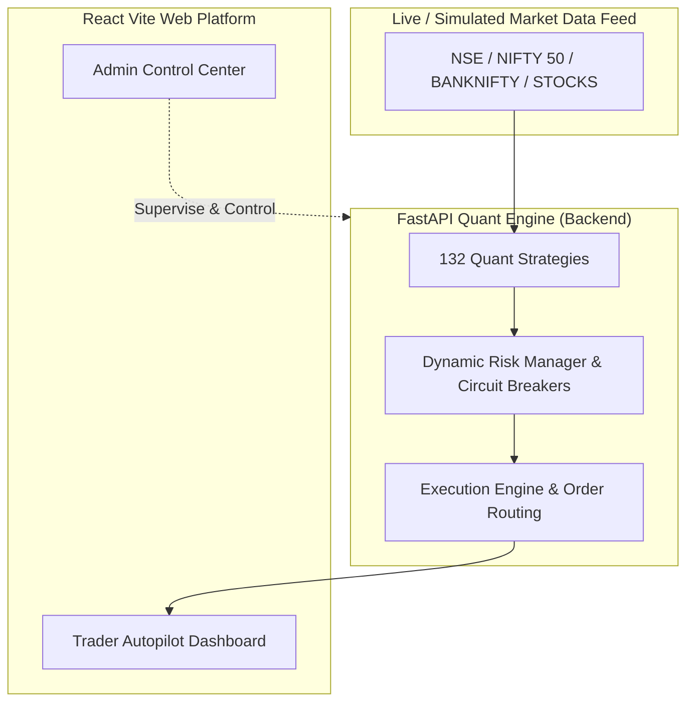
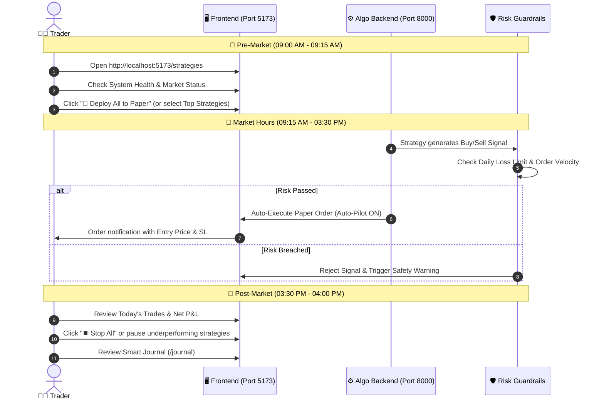

# 📘 Enterprise AI Algo Trading Platform — Complete Operational & Architectural Manual

Yeh platform **Institutional-Grade AI-Powered Quantitative Trading** ke liye design kiya gaya hai. Is document me **Admin Features**, **Trader Capabilities**, **Daily Trading Workflow**, aur **Har Ek Functionality Ka Detailed Logic** step-by-step samjhaya gaya hai.

---

## 📑 Table of Contents
1. [Architecture Overview & User Roles](#1-architecture-overview--user-roles)
2. [Admin Dashboard & System Capabilities (Logic Breakdown)](#2-admin-dashboard--system-capabilities)
3. [Trader Dashboard & Trading Capabilities](#3-trader-dashboard--trading-capabilities)
4. [Step-by-Step Daily Trading Workflow (Monday to Friday)](#4-step-by-step-daily-trading-workflow)
5. [Strategy Management & Autopilot Engine](#5-strategy-management--autopilot-engine)
6. [Risk Management & Safety Guardrails](#6-risk-management--safety-guardrails)
7. [Paper Trading vs Live Broker Trading](#7-paper-trading-vs-live-broker-trading)
8. [FAQ & Best Practices](#8-faq--best-practices)

---

## 1. Architecture Overview & User Roles

Platform me **2 Primary Roles** define kiye gaye hain:

| Role | Access URL | Primary Objective |
| :--- | :--- | :--- |
| **🛡️ Admin** | `http://localhost:5173/admin/dashboard` | System Risk, Broker Connections, Live Gate Approval, Global Kill-Switch, Audit Trail, Reconciliation |
| **📈 Trader** | `http://localhost:5173/dashboard` | Strategy Deployment, Paper/Live Trading, Signals Approval, Orders, Portfolio & Trading Journal |

---

## 2. Admin Dashboard & System Capabilities

Admin panel enterprise risk management aur compliance ke liye banaya gaya hai.

### 2.1 🛡️ Live Risk & Capacity Monitor (`/admin/risk`)
* **Dynamic Exposure Meter:** Portfolios ka total market exposure real-time me track karta hai.
* **Daily Loss Limit Breach:** Maximum daily loss threshold (e.g. ₹5,000 / 2% capital) cross hone par warning banner trigger karta hai.
* **Order Velocity Limiter:** 1 minute me kitne orders place hue hain (Throttling check) taaki runaway algo prevent ho sake.
* **Reset Paper Account:** Virtual balance ko ₹10,000 / ₹25,000 / ₹50,000 / ₹1,00,000 par 1-click me reset karne ki facility.

### 2.2 🚨 Master Kill Switch (`/admin/kill-switch`)
* **Emergency Halt:** Agar market me koi unexpected spike ya flash crash ho, toh Admin 1-click me saari 132 strategies ko instant halt kar sakta hai.
* **Auto-Cancel Open Orders:** Kill switch activate hote hi saare pending open limit orders automatically cancel ho jaate hain.

### 2.3 🚪 Live Trading Gate Approval (`/admin/live-gate`)
* **Safety Lock:** Koi bhi strategy direct real live money se trade nahi kar sakti jab tak Admin use Live Gate me certify na kare.
* **Readiness Check:** Paper trading metrics (Win Rate, Profit Factor, Max Drawdown) satisfy hone par hi Live mode unlock hota hai.

### 2.4 🔗 Broker Management (`/admin/brokers`)
* **Multi-Broker Integration:** Zerodha Kite, Angel One, Upstox, Dhan, Fyers, Paper Broker.
* **API Credentials:** API Key, Secret Token, TOTP 2FA configuration aur real-time connection status check.

### 2.5 ⚖️ Trade Reconciliation (`/admin/reconciliation`)
* Platform ke database positions aur broker ke real exchange positions ke beech discrepancy (mismatch) ko auto-detect karta hai aur sync karta hai.

### 2.6 📋 Audit Logs (`/admin/audit`)
* Har user action (Login, Strategy Start/Stop, Parameter Change, Order Place, Kill-Switch) timestamp ke saath immutable log me store hota hai.

---

## 3. Trader Dashboard & Trading Capabilities

Trader workspace day-to-day algo execution ke liye tailor kiya gaya hai.

### 3.1 ⚡ Strategy Management & Autopilot (`/strategies`)
* **132 Quant Strategies Library:** Rule-Based, ML Classification, FinBERT NLP Sentiment, Pairs Arbitrage, Mean-Reversion, Momentum Scalping.
* **Batch Controls:**
  * `🚀 Deploy All to Paper`: Ek click me sabhi 132 strategies ko active kar deta hai.
  * `⏹️ Stop All`: Ek click me sabhi strategies ko safely stop kar deta hai.
* **Individual 2-Way Control:**
  * Jab Strategy **Active** ho -> Card par **`⏹️ Stop Strategy`** (Red) button dikhega.
  * Jab Strategy **Stopped** ho -> Card par **`▶️ Resume Strategy`** (Green) button dikhega.
* **Dynamic Budget:** Har strategy Virtual ₹10,000 initial balance aur 1% per-trade risk ke hisaab se position size calculate karti hai.

### 3.2 📊 Trading Dashboard (`/dashboard`)
* **Real-time P&L Chart:** Daily profit/loss curve aur cumulative balance growth.
* **Active Position Count:** Kaunse stocks (e.g. INFY, RELIANCE, HDFCBANK) me trade chal raha hai.
* **Market Session Indicator:** Pre-Market (9:00-9:15), Regular Trading (9:15-15:30), Post-Market (15:30-16:00).

### 3.3 📦 Orders & Positions (`/orders`, `/portfolio`)
* **Live Orders:** Pending, Executed, Rejected, Cancelled orders ki live list.
* **Open Positions:** Quantity, Entry Price, Current Market Price (LTP), Unrealized P&L, aur Target/Stop-Loss levels.
* **Manual Exit Option:** Trader chahe toh kisi bhi position ko market price par instant square-off kar sakta hai.

### 3.4 📓 Smart Trading Journal (`/journal`)
* Automatic trade logging jisme Entry Reason, Exit Reason, Strategy Name, Emotion Note, aur Profit/Loss store hota hai.

---

## 4. Step-by-Step Daily Trading Workflow

Institutional trader ki tarah trading karne ka recommended standard routine:

---

## 5. Strategy Management & Autopilot Engine

### 5.1 Auto-Pilot vs Advisory Mode
* **⚡ AUTO-PILOT ON (Full Autonomous):** Signal aane par system bina trader ke click kiye automatically BUY order place karta hai, ATR Trailing Stop-Loss update karta hai, aur Target hit hone par exit karta hai.
* **📋 ADVISORY MODE (Manual Approval):** Signal screen par pop-up karta hai, aur Trader jab `Approve` button dabata hai tabhi order place hota hai.

### 5.2 Dynamic Funds Sizing Logic
Platform fixed arbitrary quantity use nahi karta, balki **Quant Position Sizing Formula** use karta hai:

$$\text{Quantity} = \min\left(\left\lfloor\frac{\text{Cash Balance} \times 0.01}{\text{Entry Price} - \text{Stop Loss Price}}\right\rfloor, \left\lfloor\frac{\text{Max Capital Per Trade}}{\text{Entry Price}}\right\rfloor\right)$$

* Yeh formula ensure karta hai ki agar trade me Stop Loss hit ho jaye, tab bhi capital ka **maximum 1% (₹100 on ₹10k)** hi risk par rahe.

---

## 6. Risk Management & Safety Guardrails

Platform me **5 Layers of Risk Protection** embedded hain:

1. **Max Daily Loss Cut-off:** Agar din ka total loss preset limit cross kare, system trading automatically suspend kar deta hai.
2. **Order Velocity Throttling:** 60 seconds me maximum allowed orders se zyada aane par algo ko rate-limit karta hai.
3. **ATR Trailing Stop-Loss:** Jaise jaise stock profit me jaata hai, Stop Loss automatically upar shift hota hai taaki profit lock ho sake.
4. **Market Regime Adaptive Filter:** Trending market strategies Sideways market me execute nahi hoti.
5. **Circuit Breaker:** Gap-down ya high volatility news event par system new positions block kar deta hai.

---

## 7. Paper Trading vs Live Broker Trading

| Feature | 🛡️ Paper Trading (Virtual Sandbox) | 🔴 Live Broker Trading |
| :--- | :--- | :--- |
| **Risk** | **₹0.00 (Zero Risk)** | Asli Paisa (Real Financial Risk) |
| **Balance** | Virtual ₹10,000 (Resetable anytime) | Aapka Real Demat/Trading Account Balance |
| **Speed & Execution** | Real-time live exchange tick simulation | Broker API (Zerodha / Angel / etc.) routing |
| **Purpose** | Strategy validation, win-rate & edge testing | Real profit generation on proven strategies |

---

## 8. FAQ & Best Practices

#### Q1: Kya mujhe Monday ko real paisa dalna padega?
**Nahi.** System completely **Paper Sandbox Mode** me configured hai. Aap virtual ₹10,000 se pure 2 hafte test kar sakte hain.

#### Q2: Agar koi ek strategy acha perform nahi kar rahi ho toh?
Aap **`http://localhost:5173/strategies`** par jakar sirf us specific strategy ke card par **`⏹️ Stop Strategy`** dabakar use band kar sakte hain, jabki baki strategies chalti rahengi.

#### Q3: System ko start aur stop kaise karein?
* **Start Services:** Project root me `start-all.bat` par double click karein.
* **Stop Services:** Project root me `stop-all.bat` par double click karein.

---

*Manual generated and verified for Enterprise AI Algo Trading Platform v1.0.0.*
